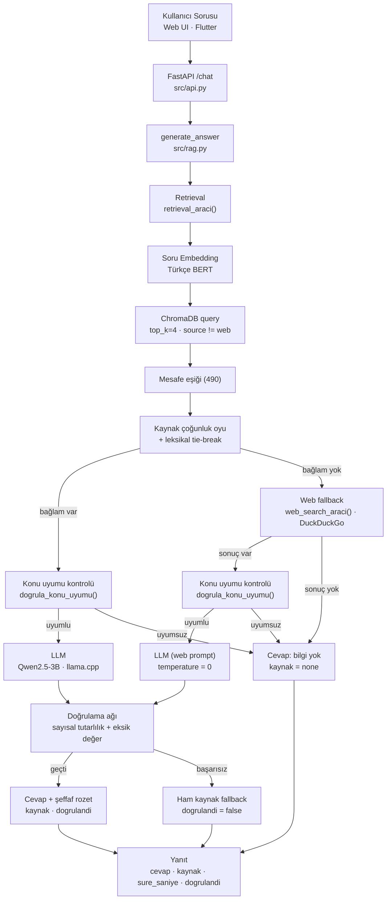

# CV Asistanı — Yerel, Açık Kaynak RAG Chatbot

Tamamen açık kaynak modellerle, herhangi bir dış API'ye bağımlı olmadan
çalışan; kendi projelerim hakkında soru cevaplayan, halüsinasyon
kontrolü olan bir RAG (Retrieval-Augmented Generation) chatbot sistemi.

**Donanım:** Intel i3 9. nesil, 8GB RAM — GPU yok. Sistem, mütevazı
donanımda çalışacak şekilde baştan tasarlandı.

---

## Ne Yapıyor

Chatbot, GitHub'daki 4 projem hakkında soru cevaplıyor: **BilgiTR**
(RAG projesi), **YorumTR** (Türkçe duygu analizi), **HizmetGelsin**
(Flutter+ASP.NET Core uygulaması), **Telco Churn** (müşteri kaybı
tahmini). Elindeki veride cevap yoksa internette arayıp öğreniyor;
emin olmadığında asla uydurmuyor, dürüstçe kaynağı gösteriyor.

---

## Mimari



Akış uçtan uca: soru `src/api.py` içindeki `/chat` uç noktasına gelir,
iş mantığı `src/rag.py` içindeki `generate_answer()` fonksiyonunda
yürütülür. Önce yerel vektör deposunda (ChromaDB) arama yapılır;
alakalı bağlam yoksa DuckDuckGo üzerinden web fallback'e geçilir. Her
iki yolda da üretilen cevap, modele gönderilmeden önce konu uyumu,
sonrasında ise sayısal tutarlılık + eksik değer kontrollerinden geçer.

**Bileşenler:** FastAPI (HTTP + statik arayüz) · ChromaDB (kalıcı vektör
deposu) · Türkçe BERT embedding · llama.cpp üzerinden Qwen2.5-3B ·
DuckDuckGo (ddgs) · üç katmanlı doğrulama ağı.

---

## Teknik Kararlar ve Gerekçeleri

### Model seçimi: Qwen2.5-3B-Instruct

Üç model (1.5B / 3B / 7B) gerçek ölçümlerle karşılaştırıldı:

| Model | Süre | Sonuç |
|---|---|---|
| 1.5B | ~23 sn | Çoklu/sayısal değerleri sık kaçırıyor |
| **3B** | **~30-60 sn** | Doğruluk yeterli, hız kabul edilebilir — **seçilen** |
| 7B | ~2.5-3.5 dk | En doğru ama i3'te kullanılamayacak kadar yavaş |

7B'nin yavaşlığının RAM değil **CPU hesaplama gücü** darboğazı olduğu
ayrıca doğrulandı — RAM optimizasyonları hıza etki etmedi.

### Embedding modeli: Türkçe'ye özel BERT

Üç aday (MiniLM, mpnet, Türkçe BERT) karşılaştırıldı; Türkçe'ye özel
eğitilen model, konu/şehir ayrımını en doğru yapan model çıktı.
Mesafe eşiği (490), gerçek ölçümlere bakılarak kalibre edildi.

### Halüsinasyon kontrolü — 3 katman

1. **Sayısal tutarlılık** — cevaptaki sayılar kaynakta var mı?
2. **Eksik değer tespiti** — kaynaktaki bir liste (örn. 3 skor) cevaba
   eksik mi yansıdı?
3. **Konu uyumu** — cevap gerçekten sorulan konuyla mı ilgili? (Bu,
   modelin alakasız bir web sonucundan "kendinden emin ama yanlış"
   bir cevap üretmesini engelliyor.)

Herhangi biri başarısız olursa, sistem cevabı reddedip ham kaynağı
(doğru dosyadan, açıkça etiketlenmiş) gösteriyor — asla sessizce
yanlış bilgi vermiyor.

### Kaynak karışması düzeltmesi

Embedding modelinin L2 mesafesi bazen yanlış dökümanı "yakın"
gösterebiliyordu. Çözüm: chunk'lar önce kaynak dosyaya göre
gruplanıp çoğunluk oyuyla karar veriliyor; beraberlik durumunda
sorudaki anahtar kelimelere bakan bir tie-break devreye giriyor.

### Web fallback + cache

Yerelde bulunamayan sorular internette aranıyor (DuckDuckGo, API key
gerektirmez); öğrenilen bilgi kalıcı olarak kaydediliyor, böylece
aynı soru ikinci kez sorulduğunda 3-4 kat daha hızlı yanıtlanıyor.

---

## Arayüzler

- **Web arayüzü** — FastAPI'nin aynı içinden servis edilen, tek
  dosyalık, Apple/iMessage tarzında tasarlanmış bir sohbet arayüzü.
- **Flutter mobil uygulama** — aynı tasarım diliyle, gerçek bir
  Android cihazda uçtan uca test edildi.

İkisi de aynı `/chat` API'sini kullanıyor; her cevabın altında kaynağı
(local/web) ve doğrulama durumunu gösteren şeffaf bir rozet var.

---

## Mobil Uygulama

Flutter ile yazılmış mobil uygulama, bu repodaki `mobile/` klasöründe
durur. Apple/iMessage tarzı bir sohbet arayüzüne sahiptir ve backend'in
aynı `/chat` API'sine bağlanır. Çalıştırmak için:

```bash
cd mobile
flutter run
```

> Backend adresi `mobile/lib/api_service.dart` içindeki `apiBaseUrl`
> alanından ayarlanır (varsayılan `http://10.0.2.2:8000` — Android
> emülatörü içindir). Gerçek bir cihazda test ederken bu adresi
> bilgisayarının ağ IP'si ile değiştir.

---

## Kullanılan Teknolojiler

**Model & RAG:** Qwen2.5-3B-Instruct (GGUF, q4_k_m), llama-cpp-python,
ChromaDB, Türkçe BERT embedding (sentence-transformers)

**Backend:** Python, FastAPI, uvicorn

**Web arayüzü:** Saf HTML/CSS/JS (framework yok), Google Fonts (Inter)

**Mobil:** Flutter, Dart, http paketi

**Diğer:** DuckDuckGo arama (ddgs), Hugging Face Hub

---

## Bilinen Sınırlamalar

Bu bölüm bilinçli olarak burada — hangi kararların trade-off
olduğunu şeffafça belirtmek, hangi alanların geliştirmeye açık
olduğunu göstermek için:

- **Cross-document sorular** (birden fazla projeyi karşılaştıran
  sorular) şu an tek dökümana daralıyor — kaynak karışması
  düzeltmesinin bilinçli bir trade-off'u.
- **Cosine mesafeye geçiş** yapılmadı; mevcut leksikal tie-break bir
  yama, kök neden (L2 mesafesinin embedding normalizasyonuna
  duyarlılığı) hâlâ duruyor.
- **Segmentation fault riski** — llama.cpp'nin C++ katmanında, bellek
  baskısı altında nadiren oluşan bir kararsızlık. Python seviyesinde
  yakalanamıyor; etkisi `n_threads` düşürülerek azaltıldı ama kök
  neden (8GB RAM sınırı) tam çözülmedi.
- **Cache eskime mantığı yok** — web'den öğrenilen bilgiler (döviz
  kuru gibi değişkenler) süresiz cache'de kalıyor.
- **Agent/function-calling** denendi (model kendi karar versin diye)
  ama 1.5B modelde güvenilir çıkmadığı için production'da
  kullanılmıyor; kod duruyor, ileride değerlendirilebilir.

---

## Neden Bu Proje

Bu proje, bir model API'sine sarmalayıcı yazmak değil — sıfırdan,
her adımı ölçerek, test ederek ve gerektiğinde geri dönüp düzelterek
kurulmuş bir sistem. Model boyutu seçiminden embedding kalibrasyonuna,
halüsinasyon kontrolünden kaynak doğrulamaya kadar her karar gerçek
verilerle destekleniyor ve nedenleri belgelenmiş durumda.
